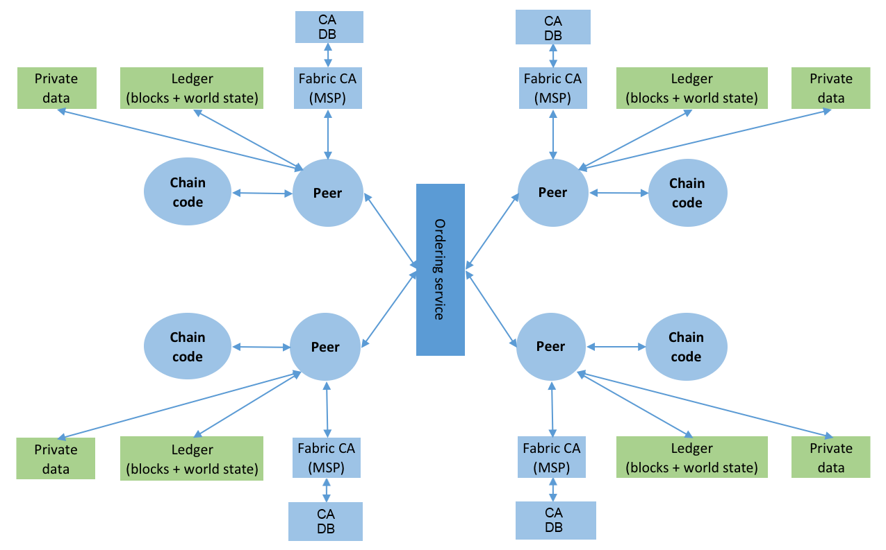
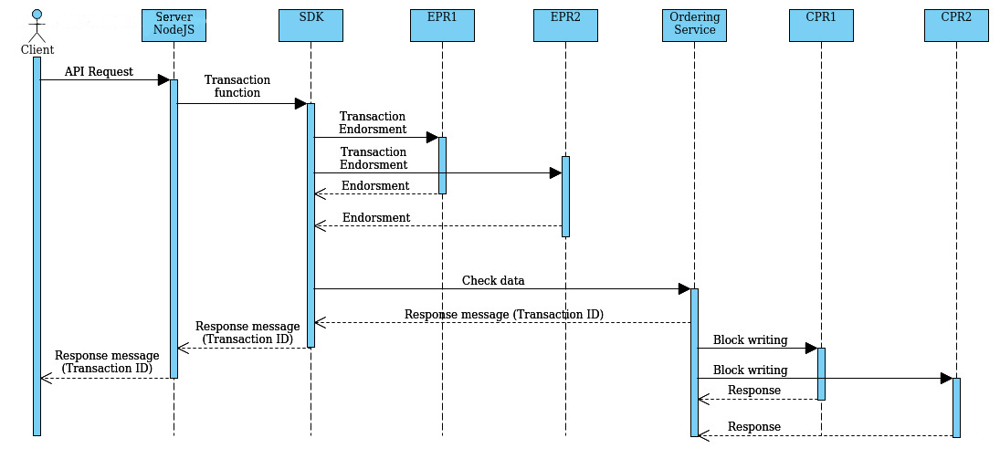

# Introduction

*Blockchain* technology identifies a write-only database in which data can be stored in the form of *transactions*. For each operation, a transaction is generated and processed by all participating nodes in the blockchain. Once all nodes (*Peers*) have verified the correct outcome of the transaction it is enclosed within a *block*. The block is then added to the blockchain, each block is linked to the previous and the next one, hence the concept of *blockchain*. *Blockchain* technology has a high level of trust by ensuring the identity of the actors (digital signature), the security of the information stored (public-key encryption), the consistency of the data against changes (one-way encryption, hashing) and the time stamping of the data (trusted timestamping).


## *Hyperledger Fabric*

*Hyperledger Fabric* is an open-source framework supported by The Linux Foundation that allows the creation of a *Distributed Ledger*. Fabric creates *permissioned blockchain* designed to be used in a private and business context. *Hyperledger Fabric* has a highly modular and configurable architecture, allowing innovation, versatility and optimization for a wide range of use cases, including banking, finance, insurance, healthcare, supply chain, digital music distribution and in general all sectors where security and transparency are needed.


### Elements and structure of *Hyperledger Fabric*

*Hyperledger Fabric* is designed with a modular structure that can model a system according to your needs. The modelling of the system is based on the customization of the number of elements that make up the network and their interaction. The elements present in *Hyperledger Fabric* can be divided into *abstract* and *physical* elements.

1.  Physical Entities

    -   *Peer*:
    
    They are the actual nodes of the blockchain, they are in charge of validating and approving transactions, therefore, writing to the *Ledger* under their responsibility. When a *peer* believes that a transaction is acceptable, it applies on the transaction his own signature and shares that with others.
    
    -   *StateDB* (*CouchDB* or *LevelDB*):
    
    Each *Peer* communicates with a state database that is intended to act as an aid to the *Peers*. In particular, it is responsible for saving data necessary for the validation and approval of transactions. It is currently possible to choose between two types of state databases both non-relational (*NoSQL*): document-oriented (CouchDB) and key-value (LevelDB).
    
    -   *Certificate Authority* (*CA*):
    
    Often referred to as *CA*, *Certificate Authorities* are responsible for creating and managing the certificates necessary to ensure the security of the entire system. Each *Certificate Authority* is entirely dedicated to a specific part of the blockchain, therefore, no other element will be able to generate certificates from a *Certificate Authority* other than its own.
    
    -   *Ordering Service*:
    
    This is the entity in charge of receiving all *signatures* of transactions sent by *Peers*. Once all the *signatures* have been received, it certifies their validity and, according to the policies defined in the *Network*, authorizes the transactions, generating a new block. Once a block of transactions has been generated, it will send the information about the block to the *Peers* who will write the transactions on the Ledger.
    
    -   *Chaincode*:
    
    The *smart-contract* present within the *Peers* is called *chaincode*. The *chaincode* is a program shared between the *Peers* of the same *Channel* in which the transactions are defined and implemented. The *chaincode* takes care of controlling the data and defining the real logic of the network. It is possible to use more than a *chaincode* in the network based on your needs.

2.  Abstract entities

    -   *Ledger*:
    
    These are the actual registers of the blockchain where transactions are written. Each *Ledger* can only be updated by the *Peers* linked to it and only after transactions have been validated and approved. Furthermore, no *Network* entity can in any way remove a transaction written on the *Ledger*. The only operation allowed is the writing of transactions validated and approved by the *Network*.
    
    -   *Membership Service Provider* (*MSP*):
    
    The MSP is a component of the *Network* that is responsible for defining validation, authentication, and access policies for the *Network*. It manages users, authenticates them and authorizes them to perform operations within the network thanks to the credentials generated by the *Certificate Authorities*.
    
    -   *Organizations* (*Org*):
    
    They are defined within the *Network* as *Org*, they are entities that deal with differentiating companies, structures or any form of *actor*, within the system. Each Organization has its own *Peers* (and associated state database) and its own *Certificate Authorities*.
    
    -   *Channels*:
    
    These are communication channels that allow different *Organizations* to share and operate on the same information in the *Network*. In particular, only the *Organizations* of the same *Channel* will be able to manage the transactions that take place within it and, therefore, will be able to visualize the transactions, express consent and write to the same *Ledger*.


## Hyperledger Fabric Architecture example




## Docker Engine

All the elements, components and sub-systems in the project are created with the help of using the *Docker Engine*. *Docker* is an open-source containerization technology for building and deploying applications. *Docker* allows the creation of applications with the same logic but with separate instances thanks to *Docker Images*. A *Docker Image* is a particular image comparable to a virtual machine that can be instantiated multiple times on the same system quickly and easily ensuring a separate environment between instances. The use of *Docker Images* also improves system performance in terms of stability, performance, security, usability and maintenance.


## Transaction Flow

A transaction within the *Network* is the only type of operation that allows you to interact with the *Ledger*. There can be various types of transactions in a blockchain defined by the *Smart Contract*, the same goes for *Hyperledger Fabric* which allows the definition of various transactions according to one&rsquo;s needs. Transactions are defined within the *Chaincode* instantiated on the *Peers*, the latter takes care of the actual validation and transaction.


### Generic Transaction flow

A transaction whose purpose is the insertion of data communicated by the client that, through a web application, is sent to a Server through the *REST API*. Once checked the integrity of the data, the server thanks to the use of the *SDK* provided by *Hyperledger Fabric* forwards the data to the *Network*, more precisely to the *Endorsing Peers*. The *Endorsing Peers* have the task of evaluating the transaction, more in detail, they verify the correctness of the data and the feasibility of the transaction according to the status of the Ledger. If the data is correct, a *Signature* that ascertains the consent to the validity of the data is placed on the transaction. The *Signatures* are then forwarded to the *Ordering Service*, which will check that all *Peers* have validated the transaction and, according to *Network policies*, will generate a new block containing the new *Ledger* status. The information about the new block is then forwarded to the *Committing Peers* which will write the block containing the transaction on the *Ledger*, generating a new *Ledger* state.




# Getting started with Hyperledger Fabric

Getting started creating a base Hyperledger Fabric network following the official [documentation](https://hyperledger-fabric.readthedocs.io/en/latest/write_first_app.html). Note that the following commands are tested only with Hyperledger Fabric version 2.4.2.


## Workflow

The application interacts with the network through the *peers* and a smart contract. The *peers* validate the transaction and creates a new ledger block. Once created, the smart contract sends back to the application the updates.


## Prepare the environment

First of all, you need to install the dependencies and set up the environment. Follows the official documentation [prerequisites](https://hyperledger-fabric.readthedocs.io/en/latest/prereqs.html).


### Install required packages

The following packages are required: `git`, `curl`, `go`, `jq`, `docker` and `docker-compose`. Install them using your favourite package manager.


### Install Node.js JavaScript V8 engine runtime

Install a Node.js supported version. Hyperledger Fabric supports Node.js versions 14 and 16. To install and manage a specific Node.js version you can use [nvm](https://github.com/nvm-sh/nvm). Please, in case of troubleshooting follows the official documentation.

```shell
curl -o- https://raw.githubusercontent.com/nvm-sh/nvm/v0.39.1/install.sh | bash
```

Add the following lines in your `~/.bashrc`, `~/.bash_profile` or `~/.profile`.

```shell
export NVM_DIR="$([ -z "${XDG_CONFIG_HOME-}" ] && printf %s "${HOME}/.nvm" || printf %s "${XDG_CONFIG_HOME}/nvm")"
[ -s "$NVM_DIR/nvm.sh" ] && \. "$NVM_DIR/nvm.sh" # This loads nvm
```


## Download `fabirc-samples`, docker images, and binaries

Hyperledger crates a useful Hyperledger Fabric Samples repository that you can use to get started working with it, explore important features, and learn how to build applications that can interact with blockchain networks using the Fabric SDKs. Also, Hyperledger Fabric has some binaries that are required to interact with the network.

```shell
curl -sSL https://bit.ly/2ysbOFE | bash -s -- 2.4.2 1.5.2
```

This script clone `hyperledger/fabric-samples` repository and the required binaries into `fabric-samples/bin` directory.


## Start the test network

Enter in `test-network` directory and start the network.

```shell
cd fabric-samples/test-network
./network.sh up createChannel -c mychannel -ca
```

This command will deploy the Fabric test network with two peers, an ordering service, and three certificate authorities (Orderer, Org1, Org2). Note that the `-ca` flag bring up the test network using certificate authorities and also the org admin user registration is bootstrapped when the certificate authority is started.


## Deploy our smart contract

Deploy the chaincode package containing the smart contract.

```shell
./network.sh deployCC -ccn basic -ccp ../asset-transfer-basic/chaincode-typescript/ -ccl typescript
```

This script uses the chaincode lifecycle to package, install, query installed chaincode, approve chaincode for both Org1 and Org2, and finally commit the chaincode.


## Interact with the chaincode

Prepare a sample application to interact with the deployed smart contract.

```shell
cd ../asset-transfer-basic/application-gateway-typescript
npm install
npm start
```


## Understand how Smart Contract work

The Smart Contract defines the transactions and how they work. The `@Transaction()` descriptor set the following function as a transaction. To write a new asset on the ledger the Smart Contract use the `putState()` method.

```typescript
@Transaction()
public async InitLedger(ctx: Context): Promise<void> {
        const assets: Asset[] = [
            {
                ID: 'asset1',
                Color: 'blue',
                Size: 5,
                Owner: 'Tomoko',
                AppraisedValue: 300,
            },
            {
                ID: 'asset2',
                Color: 'red',
                Size: 5,
                Owner: 'Brad',
                AppraisedValue: 400,
            },
            {
                ID: 'asset3',
                Color: 'green',
                Size: 10,
                Owner: 'Jin Soo',
                AppraisedValue: 500,
            },
            {
                ID: 'asset4',
                Color: 'yellow',
                Size: 10,
                Owner: 'Max',
                AppraisedValue: 600,
            },
            {
                ID: 'asset5',
                Color: 'black',
                Size: 15,
                Owner: 'Adriana',
                AppraisedValue: 700,
            },
            {
                ID: 'asset6',
                Color: 'white',
                Size: 15,
                Owner: 'Michel',
                AppraisedValue: 800,
            },
        ];

        for (const asset of assets) {
            asset.docType = 'asset';
            await ctx.stub.putState(asset.ID, Buffer.from(stringify(sortKeysRecursive(asset))));
            console.info(`Asset ${asset.ID} initialized`);
        }
    }
```

To create a function that is not a transaction you need to use `@Transaction(false)` descriptor. To query the ledger use the `getState()` or `getStateByRange()` methods.

```typescript
@Transaction(false)
    @Returns('string')
    public async GetAllAssets(ctx: Context): Promise<string> {
        const allResults = [];
        // range query with empty string for startKey and endKey does an open-ended query of all assets in the chaincode namespace.
        const iterator = await ctx.stub.getStateByRange('', '');
        let result = await iterator.next();
        while (!result.done) {
            const strValue = Buffer.from(result.value.value.toString()).toString('utf8');
            let record;
            try {
                record = JSON.parse(strValue);
            } catch (err) {
                console.log(err);
                record = strValue;
            }
            allResults.push(record);
            result = await iterator.next();
        }
        return JSON.stringify(allResults);
    }
```


## Understand how chaincode interaction work


### Establish a `gRPC` connection to the Gateway

`gRPC` is a modern open-source high performance *Remote Procedure Call (RPC)* framework that can run in any environment. To interact with the network first of all you need to create a connection with a peer, which provides the *Fabric Gateway* service.

```typescript
const peerEndpoint = 'localhost:7051';

async function newGrpcConnection(): Promise<grpc.Client> {
    const tlsRootCert = await fs.readFile(tlsCertPath);
    const tlsCredentials = grpc.credentials.createSsl(tlsRootCert);
    return new grpc.Client(peerEndpoint, tlsCredentials, {
        'grpc.ssl_target_name_override': 'peer0.org1.example.com',
    });
}
```


### Create a Gateway connection

After creating a connection with the peer you need to create a connection with the *Fabric Gateway* service.

```typescript
const client = await newGrpcConnection();

const gateway = connect({
    client,
    identity: await newIdentity(),
    signer: await newSigner(),
});

async function newIdentity(): Promise<Identity> {
    const credentials = await fs.readFile(certPath);
    return { mspId: 'Org1MSP', credentials };
}

async function newSigner(): Promise<Signer> {
    const privateKeyPem = await fs.readFile(keyPath);
    const privateKey = crypto.createPrivateKey(privateKeyPem);
    return signers.newPrivateKeySigner(privateKey);
}
```


### Define the chaincode to be invoked

Define the installed chaincode through the network.

```typescript
const network = gateway.getNetwork(channelName);
const contract = network.getContract(chaincodeName);
```


### Init the ledger

Once prepared the connection and defined which chaincode to invoke you can submit a transaction. In this case, the submitted transaction is `InitLedger`

```typescript
await contract.submitTransaction('InitLedger');
```

The `InitLedger` transaction creates some assets to initialize the ledger.


### Evaluate a transaction (Query the ledger)

The method `evaluateTransaction()` allows querying the ledger. Evaluating the `GetAllAssets` transaction returns all the entries in the ledger.

```typescript
const resultBytes = await contract.evaluateTransaction('GetAllAssets');

const resultJson = utf8Decoder.decode(resultBytes);
const result = JSON.parse(resultJson);
console.log('*** Result:', result);
```


### Submit a transaction (Write on the ledger)

The method `submitTransaction()` allows performing transactions like `CreateAsset` transaction that create a new entry in the ledger.

```typescript
const assetId = `asset${Date.now()}`;

await contract.submitTransaction(
    'CreateAsset',
    assetId,
    'yellow',
    '5',
    'Tom',
    '1300',
);
```


### Update an asset

The method `submitAsync()` allows performing a transaction without waiting until the transaction is committed to the ledger. We can use that method to transfer an asset by invoking the `TransferAsset` transaction.

```typescript
const commit = await contract.submitAsync('TransferAsset', {
    arguments: [assetId, 'Saptha'],
});
const oldOwner = utf8Decoder.decode(commit.getResult());

console.log(`*** Successfully submitted transaction to transfer ownership from ${oldOwner} to Saptha`);
console.log('*** Waiting for transaction commit');

const status = await commit.getStatus();
if (!status.successful) {
    throw new Error(`Transaction ${status.transactionId} failed to commit with status code ${status.code}`);
}

console.log('*** Transaction committed successfully');
```


## Stop the network and clean the environment

To stop and clean the network simply use again `network.sh`.

```shell
cd ../../test-network
./network.sh down
```
